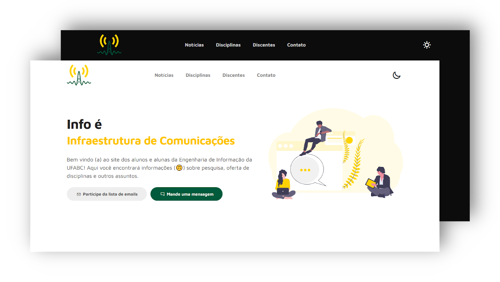

  

# O site dos discentes da Info!

Bem vindo (a) ao repositório do site dos alunos e alunas de Engenhaira de Informação da Universidade Federal do ABC (UFABC). Faça uma visita em [info-ufabc.github.io](https://info-ufabc.github.io/) .

## Agradecimentos

* [Tooplate](https://www.tooplate.com/), ao template usado como base para esse projeto.

* [unDraw](https://undraw.co/), às ilustrações que dão vida para a página.

* [Iconscout](https://github.com/Iconscout/unicons), aos ícones usados em todo o site.
